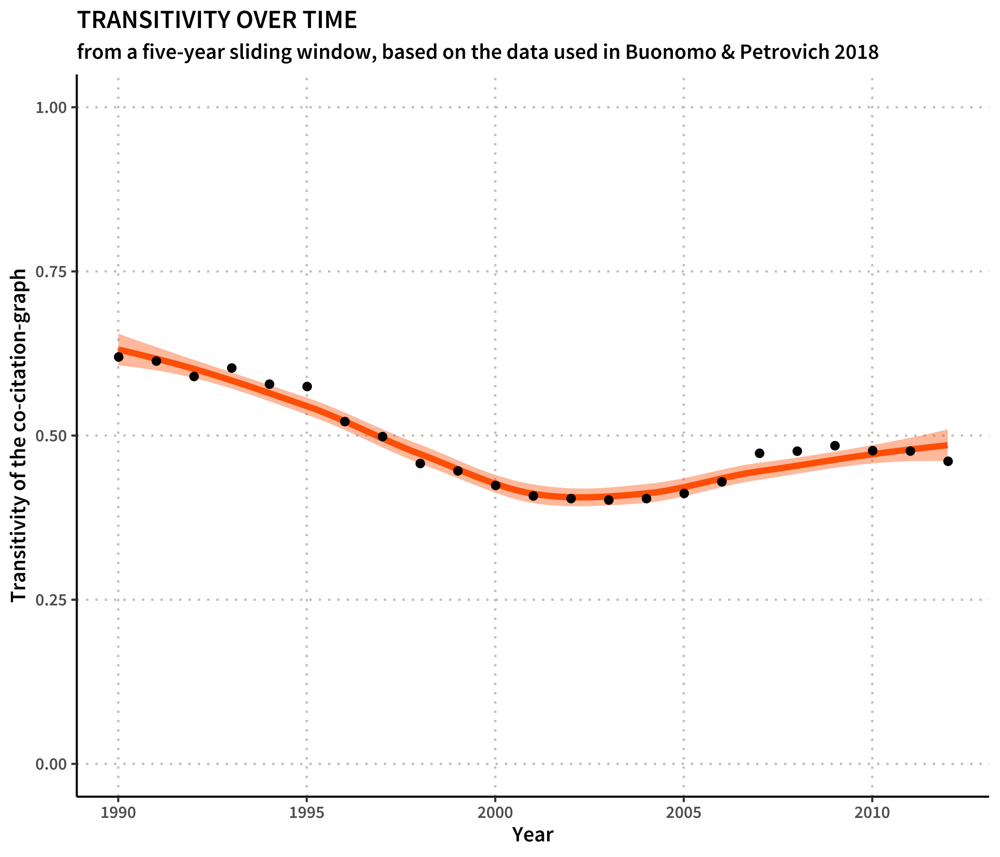
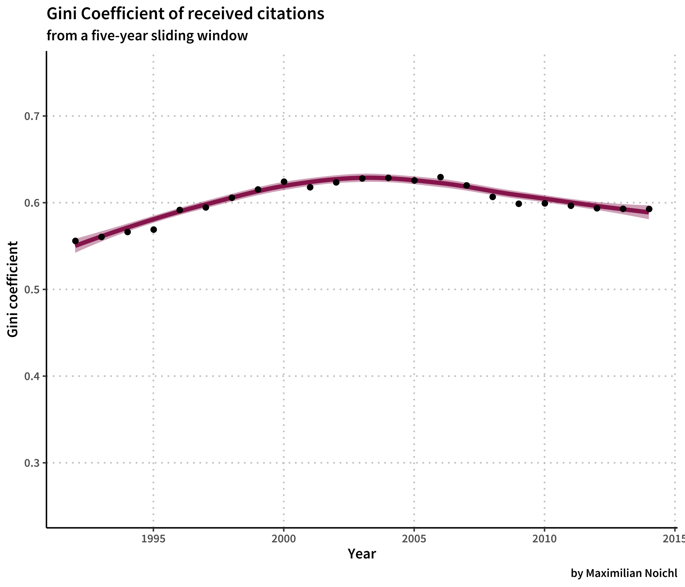
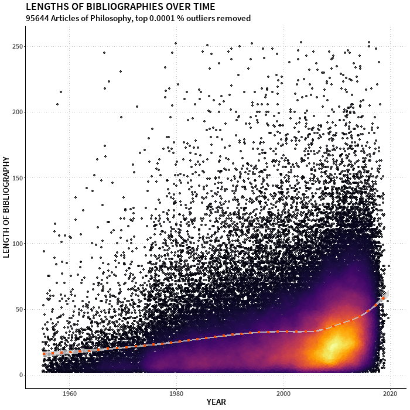

# [Draft] A short and informal replication of Petrovich and Buonomo 2018

I recently came across a very interesting study by Eugenio Petrovich and
Valerio Buonomo (2018), in which they analyze co-citation networks for the last
three decades of analytic philosophy. After a bit of conversation with
Eugenio, I thought that I would do a little quasi-replication of their
results, to try out some things.

So I downloaded the sample Petrovich and Buonomo used from the Web of
Science. It consists of the years 1985-2014 from the following five
journals: 

* Philosophical Review
* Nous
* Journal of Philosophy
* Mind
* Philosophy and Phenomenological Research

The question that Petrovich and Buonomo are interested in is whether analytic philosophy has become more diverse in these
thirty years. There various ways in which one could approach this
question. Petrovich and Buonomo go for visual inspection, and I will try to present an approach to that later. But, first and foremost Eugenio and
me were talking about formal evaluation of the co-citation graphs. In
what follows I am very much inspired by Tang, Cheng, and Chen (2017) who
present a recommendable longitudinal study of the digital humanities.

So the first thing I did was to try and get the transitivities for the
different samples.
[Transitivity](https://mathinsight.org/definition/transitivity_graph)
is a very basic measure of how much a graph tends to cluster. It
results from three times the number of triangles in the graph (in our case those triangles consist of three
sources, of which each combination was co-cited at least once) divided
by the number of triplets (any three sources). A fully connected graph would score the
number 1 on this measure, while a completely unconnected graph would
result in a 0. For this little exercise I will use a sliding window
approach, in which I always consider 5 years together. It results in the following picture:

As we can see, the transitivity gets smaller over time, reaches its lowest point after 2000, and then rises again. I have also looked into the size of the giant component of the network, which is the largest connected sub-graph. In all cases it was higher than 93 %, and slowly approaching 98 % over time, which means, that nearly all cited sources were connected via co-citation with the others. In other words: There was only one large network of philosophy, not many small unconnected sub-networks. As this was mostly constant, we should be able to interpret the falling transitivity as diminished local co-citation.

 ...
# Gini Coefficients
There is another
interesting thing we can do to get an idea about dynamics in the discipline. In some sense, citations can be considered the currency of academia. And like regular currency, some receive more, some less. Indeed, like with regular currency, a select few receive a *lot* more then everyone else. This suggests that we can use the same tools that are used to quantify inequality in societies over time to quantify inequalities in citation-counts over time. Below I have calculated the *Gini-coefficients* over the same five year windows used above (using a snippet by [Olivia Guest](https://github.com/oliviaguest/gini)).

I would tend to interpret high Gini Coefficients as a sign of increased specialization, as they suggest that most articles focus on a similar set of authors. A lower gini-coefficient on the other hand might be indicative of diversification: As the circle of towering figures with very high citation-counts is enlarged, it stands to reason that also the thematic field becomes more varied. By this measure, analytic philosophy, as depicted by our sample, experienced peak specialization in the early 2000s, but has become slightly more diverse since then. 

I would like to check this against the actual content of the articles though: Given full-texts, or at least word-vectors, it would be easy to calculate similar measures.

# Visualization
Now for the most fun part, the visual inspection: A neat trick when
dealing with confusing networks is to lay out their minimum spanning
tree, instead of a usually zealously pruned version of the network
itself. I am using the wonderful tmap-library by Probst and Reymond
(2019), and will also use faerun, a visualization framework developed by
the same authors. I used the Leiden-algorithm (Traag, Waltman, and
van Eck (2019)) to identify communities in the networks, which are represented by the colours below. 

In the networks below we see the results. Because it would be annoying
to browse through 23 graphics, I will only show each of the three
decades, in the same way Petrovich and Buonomo do. To read the graphics,
remember that the minimum spanning tree-construction will try to put
the sources with the strongest connections next to each other, which is
why we have these little balls, usually around a primary source of major
importance, with which all the others are co-cited. But the algorithm
sometimes has to do trade-offs, so we can not expect every node to be
linked to its respective nearest neighbour.

I've been running the YAKE-keyword algorithm on the abstracts and titles
of the citing papers associated with the communities, so we can learn a
little bit more about them. Be mindful, we have only titles for the
first decade, which is why keyword quality here is low.

### 1985-1994
It's supposed to be interactive. If it's not, maybe try it out at [this
link](https://homepage.univie.ac.at/noichlm94/full/preprint/19851994.html).

<iframe src="https://homepage.univie.ac.at/noichlm94/full/preprint/19851994.html" width="700" height="800">
</iframe>

### 1995-2004
It's supposed to be interactive. If it's not, maybe try it out at [this
link](https://homepage.univie.ac.at/noichlm94/full/preprint/19952004.html).

<iframe src="https://homepage.univie.ac.at/noichlm94/full/preprint/19952004.html" width="700" height="800">
</iframe>

### 2005-2014
It's supposed to be interactive. If it's not, maybe try it out at [this
link](https://homepage.univie.ac.at/noichlm94/full/preprint/20052014.html).

<iframe src="https://homepage.univie.ac.at/noichlm94/full/preprint/20052014.html" width="700" height="800">
</iframe>

I think these graphics serve quite well to show how the intellectual landscape in these five journals has been broadened over time.

## Caveats

One important po

This seems to agree with general trends in philosophy. From a larger
dataset I had around (used in this visualization) I have extracted

## Literature

Petrovich, Eugenio, and Valerio Buonomo. 2018. "Reconstructing Late
Analytic Philosophy. A Quantitative Approach." *Philosophical Inquiries*
6 (1): 151--82. <https://doi.org/10.4454/philinq.v6i1.184>.

Probst, Daniel, and Jean-Louis Reymond. 2019 "Visualization of Very
Large High-Dimensional Data Sets as Minimum Spanning Trees," 27.

Tang, Muh-Chyun, Yun Jen Cheng, and Kuang Hua Chen. 2017. "A
Longitudinal Study of Intellectual Cohesion in Digital Humanities Using
Bibliometric Analyses." *Scientometrics* 113 (2): 985--1008.
<https://doi.org/10.1007/s11192-017-2496-6>.

Traag, V. A., L. Waltman, and N. J. van Eck. 2019. "From Louvain to
Leiden: Guaranteeing Well-Connected Communities." *Scientific Reports* 9
(1): 5233. <https://doi.org/10.1038/s41598-019-41695-z>.
