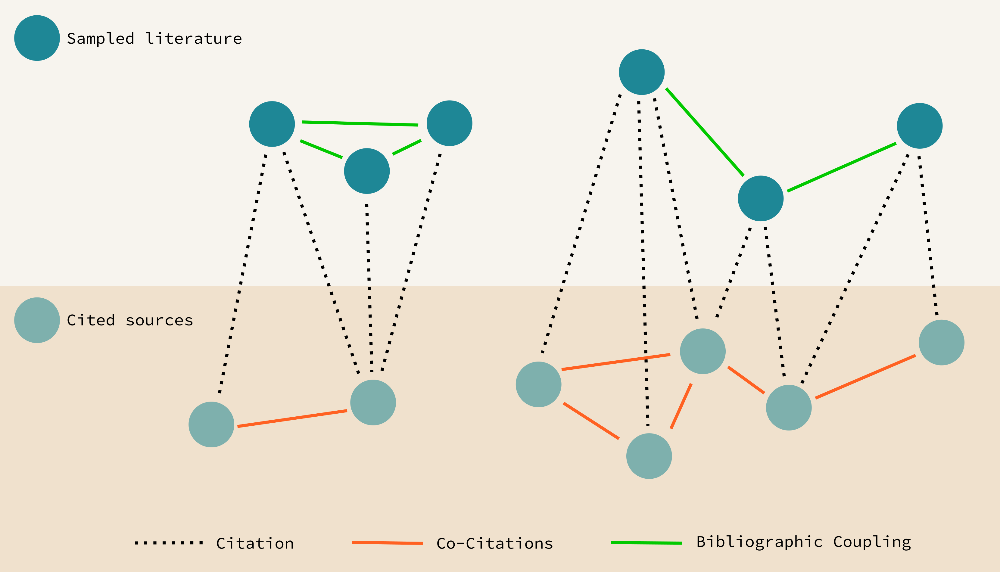
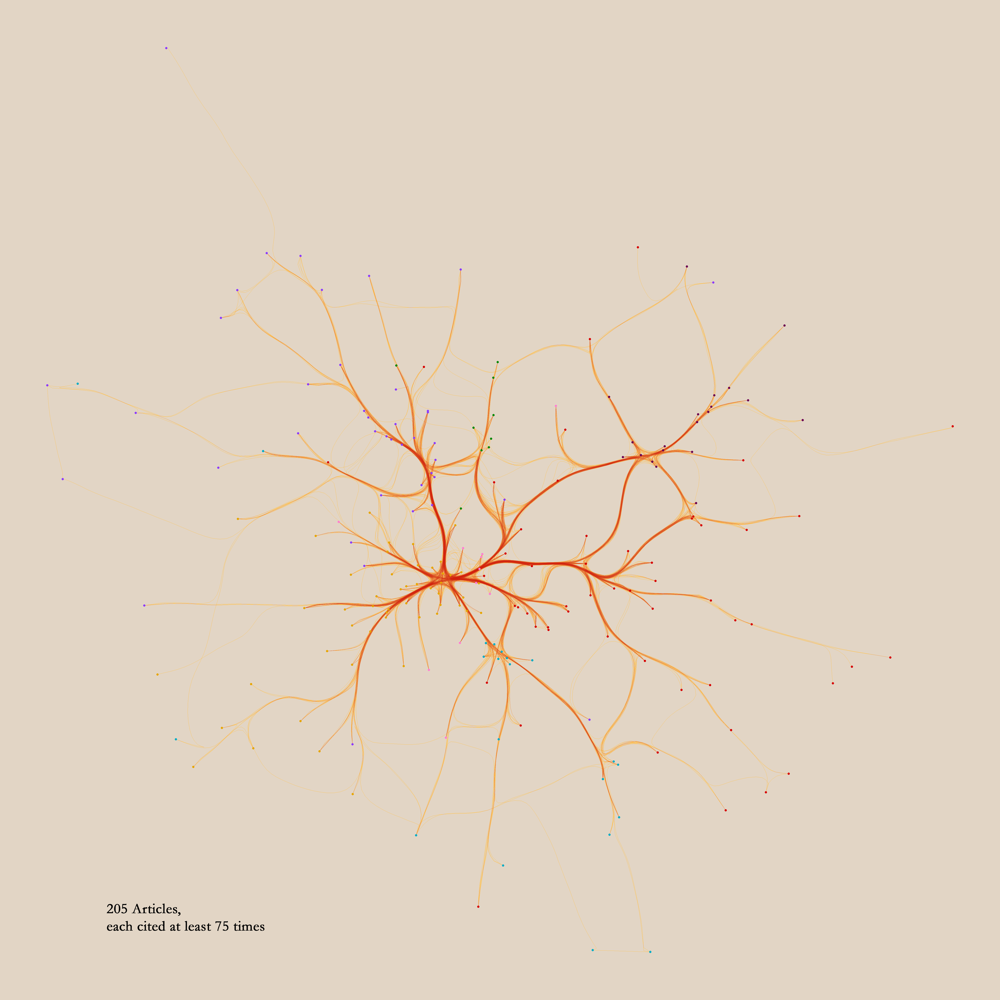
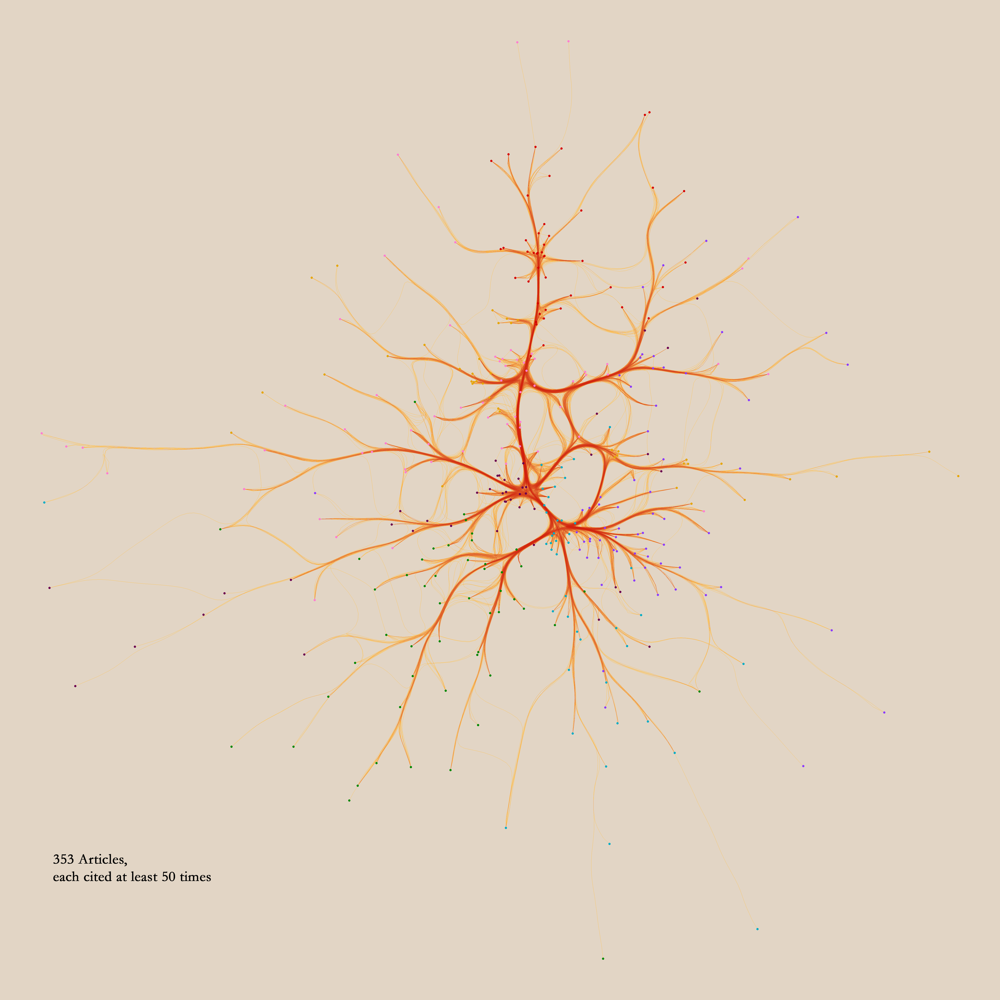

# [Draft] An argument for scale in (computational) intellectual history

In his comments on my recent post at this , Eugenio raised the interesting question of how the structure that we arive at through bibliometric methods changes, if we de- or increase the size of our sample. I will frame this question slightly different, and try to give some indication about what I belief to be the right answer to it, using again the dataset collected by Petrovich and Buonomo 2018.

Let me begin by getting a little terminology in order. When doing analyses of literature samples using citations, we mainly differentiate three types of networks: citation-networks, co-citation-networks and bibliographical coupling-networks. I have illustrated their relationships below:

A citation-network simply links all sampled articles to their cited sources, which can themselves be, but usually largely are not, in the sample. A co-citation-network, which is what Petrovich and Buonomo were using, links sources, if they are cited together by texts in the sample. And a bibliographic coupling network links articles in our sample to the degree that they cite the same sources. 

In his comment, Eugenio was, if I understood him correctly, mainly interested in the impact of the size of the sample drawn *from the co-citation network*. I think that this is an interesting question, but what I am interested below is slightly different, as I will vary the size of the literature-sample itself.

The question I'm interested in, is in how well the network structure of the most read articles, which arguably will form the picture that most people have of their discipline, mirrors the structure of the whole network. If they do  mirror it adequately – if networks of academic relations are self-similar – we can learn a lot about the structure of the whole by studying only the best and the few. If on the other hand they don't, we are always in considerable danger of error when we make structural claims about a discipline without considering large datasets. 

With a *structural claim about a discipline* I mean any claim about the unity or dis-unity of a certain body of intellectual production, and claims about the distance or nearness between multiple such bodies. This also includes common claims about changes in those structures.

Some random examples for such structural claims, which I recently came across, might be the following:

+ "Economists of education ignore sociologists of technology; cognitive scientists never use social studies of science; ethnoscience is far remote from pedagogy;" (Latour p.16)
+ "...a new and potentially more fruitful division is emerging within English speaking philosophy. In place of the old analytic–Continental split we now have the opposition between the naturalists and the neo-Kantians." (Papineau, 2003, cited after Glock, 2008, p. 258)
+ "Within the more recent literature [of Experimental philosophy], discussion of these questions has become increasingly interdisciplinary, with many of the key contributions turning to methods from cognitive neuroscience, developmental psychology, or computational cognitive science." (Knobe & Nichols, 2017)

One might at this point ask: Unity, distance, dissimilarity – regarding what measure? When these claims are made, this is often not entirely clear. And there are multiple plausible candidates for such measures. One might for example be concerned about some kind of social distance – do people interact frequently? Do they have common acquaintances? Frequent the same institutions? But one might also think about something in the realm of what might be vaguely called intellectual distances, and which would include such things as stemming from the same intellectual tradition, engaging with the same thematic field or using the same, or related concepts. 

In this case, the measure can be stated precisly: I will mainly be using bibliographic coupling, which counts the sources, which two articles share, as an indicator for their similarity. When done for all articles in a sample of literature, this results in a weighted network, which can then be processed further.

Below I have depicted such a network made from the most cited papers (at least 75 received citations) in the dataset of analytical philosophy used by Petrovich and Buonomo 2018. Each point represents a paper, colored according to the cluster that was assigned to it using Louvain-community detection, and linked to all the other papers with wich it shares citations. The layout is simply force directed (forceatlas2), and I used datashaders lovely edge-bundling capabilities to make it a little bit prettier.

What does the bibliographic coupling measure actually relate to? On the one hand it certainly has a social component to it. People might be inclined to cite their friends because they want do them a courtesy, or cite important people in their field to curry favour. On the other hand they might avoid arguably warranted citations out of personal antipathy, or for reasons of academic politics. But these behaviours are, at least from the outside, indistinguishable from intellectual reasons for citations: friends might be cited because they are likely to work in  a similar field, and possess high saliency, important people will be cited, because their work is – well – important, and because their names provide valuable shorthands, which allow the reader to locate the text in the literature. And on the whole, articles that cite a lot of the same literature can be expected to treat similar themes (I won't go into this here, but for the dataset at hand, bibliographic coupling relations and textual similarity seem to be somewhat correlated.) 

Let's have a look at a network drawn from the same sample, but lets lower our bar of entry. In the one above we considered only those papers which were cited at least 75 times. This time we look at the slightly larger sample of those that were cited at least 50 times, which adds roughly 150 articles:

This new sample of course includes the whole previous network. This means that we can now ask, how well those two networks, which represent our structural knowledge of the literature so far, match up.

A sensible way to test, how well the small, but illustrious samples match up with the larger ones from which they are drawn, is to let both undergo the same clustering process, and then count how often a pair of articles that ends up in the same cluster in  one clustering solution, ends up in the same cluster in the other one. If all the pairs from the smaller samples end up together in the same clusters in the larger sample, the structures of both samples match up very well. If on the other hand they only rarely match up, it stands to reason, that we should be very cautious in drawing inferences about the whole from structures which we noted in a small sample.

The most common measure to test how well two clustering solutions match up is the rand-index. It relates how often a pair of datapoints, which were clustered together under two different clustering methods, end up together in the same cluster under both methods to the total number of possible pairings. (See  for a nice explanation.) If the result is near one, we have a very good match up between the clusterings, if it's nearer to zero, we find little agreement. 

I have now drawn samples for all citation counts from 100 to 0 from the sample of analytical philosophy, made bibliographic coupling networks of them, partitioned them with the louvain-community-detection-algorithm, and then calculated the rand indices for all sets of articles which are present in any two samples. You can see the results in the heatmap below.

The number of clusters which our clustering-algorithm settles on is not the most relevant here: If it were for example to keep a set of articles in one sample together, but simply split that set into two in the other sample -- which might well be compatible with very similar structure -- this should not have a very large impact on the rand-index, as most pairs of nodes will still be kept together in their respective sub-clusters. I have checked my results with spectral clustering, which allows two define a constant number of clusters beforehand. It doesn't make a huge difference for the results. If anything, the rand-indices get smaller and the "channel" of high rand-indices narrows.

A lot more work remains to be done, in order to make this point more forceful. Obviously, more and different datasets ought to be considered. Also it would be interesting to check whether highly cited literature is better, worse or equally inept at matching the whole structure as randomly drawn samples. I can imagine all possibilities here: Highly cited literature might actually mirror the literature better, because it features as a shorthand for larger debates. But it might also do worse, for the very same reason, because it represents something more extreme than a random control might. I'm not entirely sure what the adequate statistics are for this, so if somebody who has ideas about it wants to get in touch, I'd be grateful. For now I'll take my leave with a last image, of the full network:

# Literature

Glock, Hans-Johann. *What is analytic philosophy?* Cambridge University Press, 2008.

Knobe, Joshua and Nichols, Shaun, "Experimental Philosophy", *The Stanford Encyclopedia of Philosophy (Winter 2017 Edition)*, Edward N. Zalta (ed.), URL = <https://plato.stanford.edu/archives/win2017/entries/experimental-philosophy/>.

Latour, Bruno. 2003. *Science in Action: How to Follow Scientists and Engineers through Society* 11. print. Cambridge, Mass: Harvard Univ. Press.

Rand, William. 1971. Objective criteria for the evaluation of clustering methods. *Journal of the American Statistical association*, 66(336):846–850