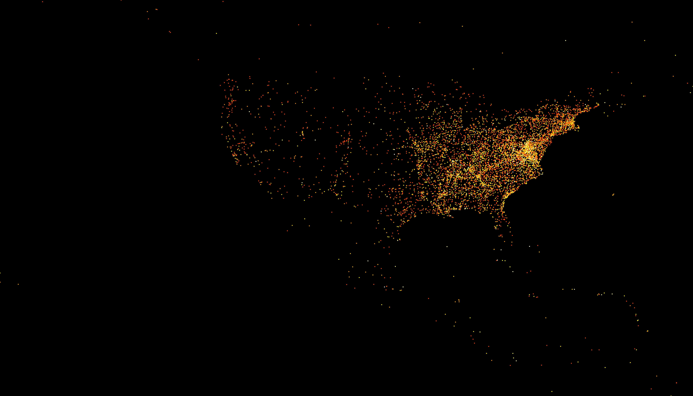

# Adding placenames from TGN to the *Daily Dispatch*

Because I did this weeks homework basically already last week by writing my own code, I have spent some time this week to learn datashader, and to plot last weeks positions with it:

